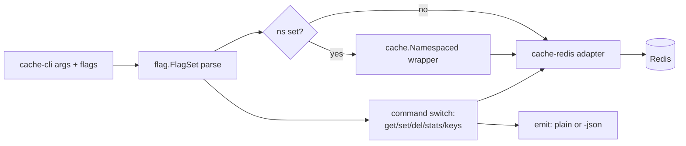

# ubgo/cache-cli — cache inspector CLI for Go / Redis


[](https://pkg.go.dev/github.com/ubgo/cache-cli) [](https://goreportcard.com/report/github.com/ubgo/cache-cli) [](https://github.com/ubgo/cache-cli/actions/workflows/test.yml) [](https://github.com/ubgo/cache-cli/actions/workflows/lint.yml)  [](https://github.com/ubgo/cache-cli/tags) [](./LICENSE) 


`cache-cli` is a tiny, scriptable command-line **cache inspector for Go** apps that use a [`github.com/ubgo/cache`](https://github.com/ubgo/cache) Redis backend. It lets you `get`, `set`, `del`, dump `stats`, and `keys`-scan a live Redis cache from your shell or CI pipeline — with optional machine-readable JSON output and meaningful exit codes for scripting.

If you operate a Go service backed by Redis through `ubgo/cache` and need to poke at the cache without writing a one-off Go program, this is the tool.

> **Documentation:** a full cookbook with scripting use cases and runnable examples for every subcommand, flag, and the exit-code / stream contracts lives in [`docs/README.md`](docs/README.md).

## Why cache-cli

- **Zero-glue debugging.** Inspect a production or local cache without embedding a debug endpoint in your service.
- **Scriptable.** Exit codes (`0` / `1` / `2`) and `-json` make it safe to use in shell pipelines, health checks, and CI.
- **Namespace-aware.** The `-ns` flag applies the same `cache.Namespaced` prefix your service uses, so keys line up exactly.
- **Same semantics as your app.** It talks through `ubgo/cache`, so `ErrNotFound`, TTL handling, and prefix scans behave identically to your running code.
- **Small surface.** Five commands, four flags. Nothing to learn.

## Features

- `get` / `set` / `del` single keys.
- `set` with a TTL via `-ttl` (Go duration syntax, e.g. `5m`, `1h30m`).
- `stats` — entries, hits, misses, hit ratio from the backend snapshot.
- `keys` — `SCAN`-based prefix listing (never `KEYS *`).
- `-json` machine-readable output for every command.
- `-ns` namespace prefixing identical to `cache.Namespaced`.
- Deterministic exit codes for scripting.

## Install

```sh
go install github.com/ubgo/cache-cli@latest
```

Requires **Go 1.24+**. The binary is named `cache-cli`.

## Quick start

```sh
# Point at a Redis instance and print backend stats.
cache-cli -addr localhost:6379 stats

# Store a value with a 5-minute TTL, then read it back.
# All flags MUST come before the subcommand.
cache-cli -addr localhost:6379 -ttl 5m set session:abc '{"uid":42}'
cache-cli -addr localhost:6379 get session:abc

# List everything under a prefix as JSON.
cache-cli -addr localhost:6379 -json keys 'session:'
```

## Architecture



The CLI builds a `redis.Client`, wraps it in the `cache-redis` adapter (which implements `cache.Cache`), optionally wraps that in `cache.Namespaced`, then dispatches the subcommand. All key semantics come from `ubgo/cache`, not the CLI.

## Usage

```
cache-cli [flags] <command> [args]
```

### Flags

| Flag | Type | Default | Meaning |
|---|---|---|---|
| `-addr` | string | `localhost:6379` | Redis server address (`host:port`). |
| `-ns` | string | `""` | Namespace prefix applied to every key via `cache.Namespaced`. |
| `-ttl` | duration | `0` | TTL for `set` only. `0` means no expiry. Go duration syntax. |
| `-json` | bool | `false` | Emit machine-readable JSON instead of plain text. |
| `-h`, `-help`, `help` | — | — | Print usage and exit `0`. |

**All flags must come before the subcommand.** The CLI parses one flag set over the whole argument list and Go's `flag` parser stops at the first non-flag argument (the subcommand). Anything after the command — including `-ttl` or `-json` — is treated as a positional argument and ignored, so `cache-cli set k v -ttl 5m` silently stores `k` with **no** TTL. Correct: `cache-cli -ttl 5m set k v`.

### `get <key>` — read a value

Prints the raw value to stdout.

```sh
cache-cli -addr localhost:6379 get user:42
# -> {"name":"ada"}

cache-cli -addr localhost:6379 -json get user:42
# -> {"key":"user:42","value":"{\"name\":\"ada\"}"}
```

Exit `1` if the key is missing (`cache.ErrNotFound`) or on any backend error. `not found` is printed to **stderr**, so stdout stays clean for piping.

### `set <key> <value>` — store a value

```sh
cache-cli -addr localhost:6379 set token abc123
# -> OK

cache-cli -addr localhost:6379 -ttl 90s set token abc123
# -> OK

cache-cli -addr localhost:6379 -json -ttl 90s set token abc123
# -> {"key":"token","ttl":"1m30s"}
```

The value is stored as raw bytes (the literal argument). A `-ttl` of `0` (the default) means the key never expires.

### `del <key>` — delete a key

```sh
cache-cli -addr localhost:6379 del token
# -> OK

cache-cli -addr localhost:6379 -json del token
# -> {"deleted":"token"}
```

`del` is idempotent at the backend level — deleting a missing key is not an error and exits `0`.

### `stats` — backend snapshot

```sh
cache-cli -addr localhost:6379 stats
# -> entries=128 hits=9001 misses=420 hit_ratio=0.955

cache-cli -addr localhost:6379 -json stats
# -> {"Hits":9001,"Misses":420,"Sets":0,"Deletes":0,"Evictions":0,"EvictionsByCause":null,"Entries":128,"Bytes":0}
```

Fields the adapter does not track stay at their zero value. `hit_ratio` is `0` when there has been no traffic.

### `keys <prefix>` — scan keys under a prefix

Uses the backend's `Iterate` (`SCAN` on Redis), so it is safe on large keyspaces.

```sh
cache-cli -addr localhost:6379 keys 'user:'
# -> user:1
#    user:2

cache-cli -addr localhost:6379 -json keys 'user:'
# -> ["user:1","user:2"]

# No prefix = scan everything the adapter can see.
cache-cli -addr localhost:6379 keys
```

### Exit codes

| Code | Meaning |
|---|---|
| `0` | Success. |
| `1` | Runtime error, or `get` on a missing key. |
| `2` | Usage error: unknown command, wrong arg count, bad flags. |

### Scripting examples

Check whether a key exists in a CI gate:

```sh
if cache-cli -addr "$REDIS" get "feature:rollout" >/dev/null 2>&1; then
  echo "rollout flag present"
else
  echo "rollout flag missing"; exit 1
fi
```

Count keys under a prefix:

```sh
cache-cli -addr "$REDIS" -json keys 'session:' | jq 'length'
```

Bulk-delete a namespace's keys (one key per line):

```sh
cache-cli -addr "$REDIS" -ns svc:billing keys '' \
  | while read -r k; do cache-cli -addr "$REDIS" -ns svc:billing del "$k"; done
```

Extract a single field from a JSON-valued cache entry:

```sh
cache-cli -addr "$REDIS" -json get user:42 | jq -r '.value | fromjson | .name'
```

## When to use this vs cache/admin

`cache-cli` is an **operator shell tool** — ad-hoc inspection, scripting, CI gates. The [`cache/admin`](https://github.com/ubgo/cache) package is an **in-process HTTP admin surface** you embed in your service for a browsable UI / API. Use `cache-cli` when you want to poke a cache from a terminal without changing the service; use `cache/admin` when you want a long-lived, authenticated admin endpoint inside the app.

## FAQ

### How do I inspect a Redis cache used by a Go service from the command line?

Install `cache-cli` and point `-addr` at the same Redis instance your service uses. Use the same `-ns` value your service passes to `cache.Namespaced` so the keys line up.

### Why does `get` on a missing key exit 1 instead of printing nothing?

So scripts can branch on the exit code. A missing key (`cache.ErrNotFound`) and a backend error both exit `1`; the human-readable reason goes to stderr, keeping stdout clean for pipes.

### Does `keys` use `KEYS *`?

No. It uses the backend's `Iterate`, which is `SCAN`-based on Redis, so it is safe to run against large production keyspaces.

### How do I get machine-readable output?

Add `-json`. Every command then prints a single JSON document to stdout.

### What duration format does `-ttl` accept?

Go's `time.ParseDuration` syntax: `300ms`, `90s`, `5m`, `1h30m`. `0` (the default) means no expiry.

### Does `del` fail if the key doesn't exist?

No. Delete is idempotent at the backend level and exits `0` whether or not the key was present.

### Can I use it without a namespace?

Yes. Omit `-ns`. Keys are then used verbatim.

## Related

- [`github.com/ubgo/cache`](https://github.com/ubgo/cache) — the core cache interface and helpers.
- `github.com/ubgo/cache-redis` — the Redis adapter this CLI drives.
